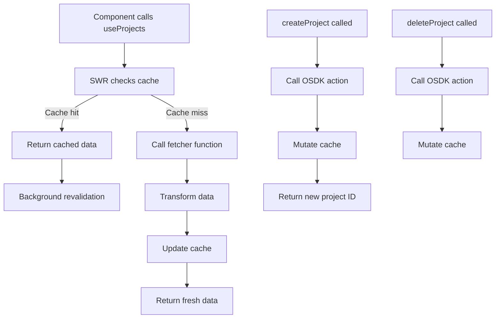

# useProjects Documentation

## Overview

The `useProjects` hook provides a comprehensive interface for managing todo projects within a React application. It leverages the Object SDK (OSDK) to interact with a backend service, offering functionality to fetch, create, and delete projects along with real-time statistics about the tasks within each project.

This hook implements Runtime Derived Properties (RDP) to efficiently calculate task statistics for each project, such as the total number of tasks and their distribution across different status categories (completed, in progress, not started). By using SWR (Stale-While-Revalidate) for data fetching, it ensures that the UI remains responsive while maintaining up-to-date data with optimized network requests.

## External Packages Used

### @tutorial-advance-to-do-application/sdk
- **Purpose**: Provides typed interfaces and functions for interacting with the todo application backend
- **Why it's used here**:
  - Offers strongly-typed models (`osdkTodoProject`) that ensure type safety when working with project data
  - Provides pre-defined actions (`createOsdkTodoProject`, `deleteOsdkTodoProject`) for standardized CRUD operations
  - Ensures consistency between frontend and backend data models
  - Abstracts away the complexity of direct API calls with a domain-specific interface

### @osdk/client
- **Purpose**: Core client library for the Object SDK (OSDK) framework
- **Why it's used here**:
  - Provides the `Osdk` type definitions for strongly-typed access to object instances
  - Enables Runtime Derived Properties through its query builder pattern
  - Offers the `PropertyKeys` utility type for extracting available property names
  - Manages serialization/deserialization of complex object structures between frontend and backend

### useSWR
- **Purpose**: React hook for data fetching with caching, revalidation, and stale-while-revalidate strategy
- **Why it's used here**:
  - Implements an intelligent caching strategy to minimize network requests
  - Provides loading, error, and validation states out of the box
  - Offers a `mutate` function to programmatically update the cache after mutations
  - Reduces boilerplate code for handling async data fetching scenarios

## Technical Concepts

### Runtime Derived Properties (RDP)

Runtime Derived Properties are a powerful pattern that allows for computing and fetching only the specific data needed at runtime, rather than retrieving entire objects and computing values client-side.

In this hook, RDP is used to calculate task statistics directly on the server:

```typescript
.withProperties({
  "numberOfTasks": (baseObjectSet) =>
    baseObjectSet.pivotTo("osdkTodoTask").aggregate("$count"),
  "numberOfCompletedTasks": (baseObjectSet) =>
    baseObjectSet.pivotTo("osdkTodoTask").where({
      "status": { $eq: "COMPLETED" },
      }).aggregate("$count"),
  // Additional properties...
})
```

This implementation uses several key OSDK patterns:

1. **`pivotTo`**: Navigates from projects to their associated tasks using the relationship between entities
   - **Purpose**: Traverses relationships between objects to access related data
   - **Parameters**: The name of the related object type to pivot to ("osdkTodoTask")
   - **Returns**: A new query builder for the related object type
   - **Benefits**: Enables joining related data without complex manual relationship management

2. **`where`**: Applies filters to select tasks with specific statuses
   - **Purpose**: Filters collections of objects based on property conditions
   - **Parameters**: An object containing property names and filter predicates
   - **Returns**: A filtered query builder that will only return matching objects
   - **Benefits**: Reduces data transfer by filtering on the server instead of client

3. **`aggregate`**: Computes count aggregations on the filtered sets
   - **Purpose**: Performs server-side data aggregation operations
   - **Parameters**: Aggregation function (e.g., "$count", "$sum", "$avg")
   - **Returns**: A scalar value representing the aggregation result
   - **Benefits**: Offloads computation to the server, minimizing data transfer

**Benefits of RDP in this implementation:**

1. **Performance optimization**: Instead of fetching all tasks and counting them client-side, the counting happens server-side, reducing data transfer
2. **Reduced client-side computation**: The client receives only the final counts, not the raw data needed to calculate them
3. **Single request pattern**: All statistics are fetched in a single request, avoiding multiple round-trips to the server
4. **Declarative data requirements**: The code clearly expresses what data is needed, making it self-documenting

### SWR Data Fetching Pattern

The Stale-While-Revalidate pattern implemented by the useSWR hook works as follows:

```typescript
const { data, isLoading, isValidating, error, mutate } = useSWR<IProject[]>(
  "projects",
  fetcher,
  { revalidateOnFocus: false }
);
```

1. First render: Returns cached data (if it exists)
2. Sends fetch request to update stale data
3. Updates with fresh data when available

This creates a seamless user experience where:
- Users see data immediately (even if slightly stale)
- The UI updates automatically when fresh data arrives
- Loading states are managed automatically

## Hook Structure

### Interface Definition

The hook defines a custom interface that extends the OSDK project type but with more specific typing for the derived properties:

```typescript
export type IProject = Osdk.Instance<osdkTodoProject, never, PropertyKeys<osdkTodoProject>> & {
  numberOfTasks: number,
  numberOfCompletedTasks: number,
  numberOfInProgressTasks: number,
  numberOfNotStartedTasks: number,
}
```

This interface:
1. Uses `Osdk.Instance` to get the base type for project objects
   - The `Osdk.Instance` type parameter `osdkTodoProject` references the base object type
   - This ensures all standard properties from the backend model are included
2. Uses `never` for the second generic parameter, indicating no Reference ID (RID) inclusion
   - This is a type parameter that controls whether the object includes reference IDs
   - Using `never` here means the interface won't expose internal reference structures
3. Uses `PropertyKeys<osdkTodoProject>` to automatically include all standard properties
   - This type utility extracts all property names from the object type
   - It ensures the interface stays in sync with backend model changes automatically
4. Adds strongly-typed non-nullable number properties for task statistics
   - These properties override any nullable versions from the base type
   - This transformation ensures frontend code doesn't need null checks

**Type transformation example**:
```typescript
// Server might return:
{
  $primaryKey: "proj123",
  name: "My Project",
  numberOfTasks: null,  // When no tasks exist
  // other properties...
}

// After transformation becomes:
{
  $primaryKey: "proj123",
  name: "My Project",
  numberOfTasks: 0,     // Null values converted to 0
  // other properties...
}
```

### Data Fetching

The data fetching strategy follows these steps:

1. **Define a fetcher function** using `useCallback` to prevent unnecessary re-renders:
   ```typescript
   const fetcher = useCallback(async () => {
     // Fetching logic
   }, []);
   ```

2. **Use Runtime Derived Properties** to fetch projects with task statistics:
   ```typescript
   const projectsPage = await client(osdkTodoProject)
     .withProperties({
       // RDP definitions for task counts
     })
     .fetchPage();
   ```

3. **Transform the data** to ensure all count properties are non-nullable:
   ```typescript
   const projects: IProject[] = projectsPage.data.map((project) => ({
     ...project,
     numberOfTasks: project.numberOfTasks ?? 0,
     // Other properties with null coalescing
   }));
   ```

4. **Use SWR to manage the data lifecycle**:
   ```typescript
   const { data, isLoading, isValidating, error, mutate } = useSWR<IProject[]>(
     "projects",
     fetcher,
     { revalidateOnFocus: false }
   );
   ```

### CRUD Operations

The hook provides two main CRUD operations:

#### Create Project

```typescript
const createProject: (name: string) => Promise<IProject["$primaryKey"]> =
  useCallback(
    async (name) => {
      const result = await client(createOsdkTodoProject).applyAction({
        name,
      },
      {
        $returnEdits: true,
      });
      await mutate();
      if (result.type === "edits") {
        return result.addedObjects[0].primaryKey as string;
      }
      throw new Error("Failed to create project");
    },
    [mutate],
  );
```

This function:
1. Takes a project name as input
2. Calls the OSDK action to create a project using `applyAction`
3. Requests edit information with `$returnEdits: true` to get information about the created object
4. Triggers a cache update via `mutate()` to refresh the projects list
5. Extracts and returns the new project's primary key from the edits object

#### Delete Project

```typescript
const deleteProject: (project: IProject) => Promise<void> = useCallback(
  async (project) => {
    await client(deleteOsdkTodoProject).applyAction({
      osdkTodoProject: project.$primaryKey
    });
    await mutate();
  },
  [mutate],
);
```

This function:
1. Takes a project object as input
2. Calls the OSDK action to delete the project using its primary key
3. Triggers a cache update via `mutate()` to refresh the projects list

### Return Value

The hook returns an object with the following structure:

```typescript
{
  projects: IProject[];      // Array of projects with task statistics
  isLoading: boolean;        // True during initial data fetch
  isValidating: boolean;     // True during background revalidation
  isError: Error | undefined; // Error object if fetch failed
  createProject: (name: string) => Promise<string>; // Function to create a new project
  deleteProject: (project: IProject) => Promise<void>; // Function to delete a project
}
```

## Usage Example

Here's how you might use this hook in a React component:

```tsx
import React, { useState } from 'react';
import useProjects from './hooks/useProjects';

const ProjectsPage: React.FC = () => {
  const { projects, isLoading, isError, createProject, deleteProject } = useProjects();
  const [newProjectName, setNewProjectName] = useState('');

  const handleCreateProject = async (e: React.FormEvent) => {
    e.preventDefault();
    if (newProjectName.trim()) {
      try {
        const newProjectId = await createProject(newProjectName);
        console.log(`Created project with ID: ${newProjectId}`);
        setNewProjectName('');
      } catch (error) {
        console.error('Failed to create project:', error);
      }
    }
  };

  if (isLoading) return <div>Loading projects...</div>;
  if (isError) return <div>Error loading projects: {isError.message}</div>;

  return (
    <div>
      <h1>Projects</h1>
      
      <form onSubmit={handleCreateProject}>
        <input
          type="text"
          value={newProjectName}
          onChange={(e) => setNewProjectName(e.target.value)}
          placeholder="New project name"
        />
        <button type="submit">Create Project</button>
      </form>
      
      <ul>
        {projects.map(project => (
          <li key={project.$primaryKey}>
            <h3>{project.name}</h3>
            <div>
              Tasks: {project.numberOfTasks} (
              {project.numberOfCompletedTasks} completed, 
              {project.numberOfInProgressTasks} in progress, 
              {project.numberOfNotStartedTasks} not started)
            </div>
            <button onClick={() => deleteProject(project)}>Delete</button>
          </li>
        ))}
      </ul>
    </div>
  );
};

export default ProjectsPage;
```

## Key Technical Points

- **Optimized Data Fetching**: Uses Runtime Derived Properties to calculate task statistics on the server, reducing data transfer and client-side computation
- **Type Safety**: Implements a comprehensive type system that ensures runtime values match expected types
- **Null Safety**: Transforms nullable server responses into non-nullable values with sensible defaults (0 for counts)
- **Cache Management**: Automatically updates the local cache after mutations to ensure UI consistency
- **Memoization**: Uses `useCallback` to prevent unnecessary re-renders and function recreations
- **Error Handling**: Provides explicit error handling for failed operations with descriptive error messages

## Edge Cases and Limitations

1. **Race Conditions**: If multiple components call `createProject` or `deleteProject` simultaneously, there could be race conditions in the cache updates. Consider implementing optimistic updates or more sophisticated cache management.

2. **Error Recovery**: The current implementation doesn't provide retry mechanisms for failed operations. In production, you might want to add retry logic or more detailed error reporting.

3. **Pagination**: The current implementation fetches all projects at once. For applications with many projects, consider implementing pagination using OSDK's `$pageSize` and `$nextPageToken` parameters:
   ```typescript
   // Paginated fetching example
   const firstPage = await client(osdkTodoProject)
     .fetchPage({ $pageSize: 10 });
   
   const secondPage = firstPage.$nextPageToken ? 
     await client(osdkTodoProject)
       .fetchPage({ 
         $pageSize: 10, 
         $pageToken: firstPage.$nextPageToken 
       }) : null;
   ```

4. **Offline Support**: The hook doesn't handle offline scenarios. For applications that need to work offline, consider implementing local storage caching and synchronization.

5. **Real-time Updates**: The hook doesn't subscribe to real-time updates. If multiple users are working on the same data, you might need to implement WebSocket or polling-based updates.

6. **Performance with Large Projects**: The RDP approach works well for moderate-sized projects, but for projects with thousands of tasks, you might need to implement more sophisticated data fetching strategies with proper pagination.

7. **OSDK Filtering Limitations**: Complex filtering operations might have performance implications. For example, text searches using `contains` on large datasets might be slow without proper indexing on the backend.

